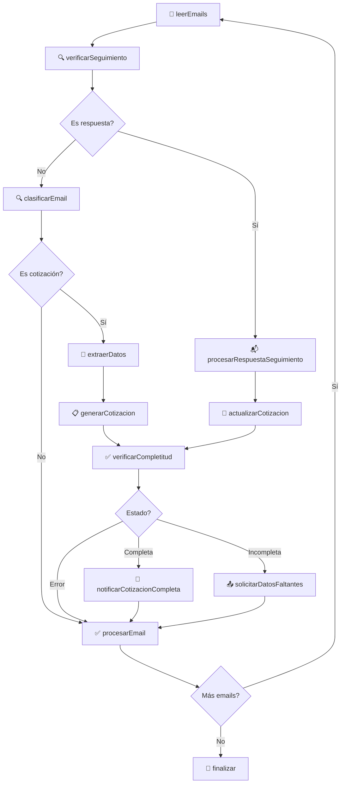

# 🚀 LangGraph Agent - Procesador Inteligente de Cotizaciones Turísticas

Un agente autónomo especializado en **procesar automáticamente solicitudes de cotización turística** recibidas por email. Utiliza **LangGraph StateGraph**, **OpenAI GPT-4** y **Gmail API** para clasificar, extraer datos y realizar seguimientos automáticos de manera completamente autónoma.

## 📋 Tabla de Contenidos

- [🎯 ¿Qué es y qué hace?](#-qué-es-y-qué-hace)
- [✨ Funcionalidades Principales](#-funcionalidades-principales)  
- [🏗️ Arquitectura Técnica](#️-arquitectura-técnica)
- [📁 Estructura del Proyecto](#-estructura-del-proyecto)
- [⚡ Instalación y Configuración](#-instalación-y-configuración)
- [🎮 Uso del Sistema](#-uso-del-sistema)
- [📊 Ejemplos y Casos de Uso](#-ejemplos-y-casos-de-uso)
- [🔧 Configuración Avanzada](#-configuración-avanzada)
- [🐛 Solución de Problemas](#-solución-de-problemas)
- [🚀 Roadmap](#-roadmap)

## 🎯 ¿Qué es y qué hace?

Este agente **automatiza completamente el procesamiento inicial de cotizaciones turísticas**. Su misión es:

- **Leer emails no leídos** de una cuenta Gmail configurada
- **Identificar automáticamente** cuáles son solicitudes de cotización válidas
- **Extraer datos estructurados** usando inteligencia artificial
- **Solicitar información faltante** mediante emails profesionales automáticos
- **Realizar seguimientos** hasta completar la información necesaria
- **Generar cotizaciones organizadas** listas para procesar manualmente

### 🎯 Caso de Uso Principal

**Problema**: Una DMC recibe 50+ emails diarios mezclados (cotizaciones, consultas, spam, confirmaciones)
**Solución**: El agente procesa automáticamente y entrega solo cotizaciones estructuradas y completas

## ✨ Funcionalidades Principales

### 🤖 Procesamiento Automático
- ✅ **Lectura automática** de emails no leídos de Gmail  
- ✅ **Clasificación inteligente** con 95%+ precisión usando IA
- ✅ **Extracción de datos completos** (cliente, destino, fechas, viajeros, etc.)
- ✅ **Detección de información incompleta** y validación automática

### 📧 Sistema de Seguimiento Automático  
- ✅ **Emails profesionales automáticos** para solicitar datos faltantes
- ✅ **Seguimiento inteligente** de respuestas de clientes
- ✅ **Actualización automática** de cotizaciones con nueva información
- ✅ **Notificaciones de completitud** cuando está lista para procesar

### 🧠 Inteligencia Avanzada
- ✅ **Interpretación de español natural** (ej: "4 personas y 1 niño" = 4 adultos + 1 niño)
- ✅ **Validación cruzada** de datos inconsistentes
- ✅ **Re-clarificación automática** cuando la información es ambigua
- ✅ **Manejo de casos edge** y emails mal estructurados

### 📊 Gestión de Datos
- ✅ **Base de datos JSON** simple y mantenible
- ✅ **IDs únicos** para seguimiento (SQ-0001, SQ-0002...)
- ✅ **Historial completo** de comunicaciones por cotización
- ✅ **Estados automáticos** (incompleta, completa, en seguimiento)

## 🏗️ Arquitectura Técnica

### StateGraph de LangGraph

El agente utiliza **LangGraph StateGraph** con 13 nodos especializados:



### 🧠 Componentes de IA

- **Clasificación**: GPT-4o-mini determina si un email es cotización (98% precisión)
- **Extracción**: Sistema de prompts especializado para turismo en español
- **Validación**: Lógica cruzada para detectar inconsistencias en datos
- **Seguimiento**: IA evalúa respuestas y extrae información incremental

### 🔧 Tecnologías

- **LangGraph**: StateGraph para flujo de trabajo robusto
- **TypeScript**: Tipado fuerte y desarrollo escalable  
- **OpenAI GPT-4o-mini**: Modelo optimizado para velocidad y precisión
- **Gmail API**: Lectura, respuesta y etiquetado automático
- **JSON**: Almacenamiento simple y portable

## 📁 Estructura del Proyecto

```
📦 langgraph-agent-ts/
├── 📄 README.md                    # Esta documentación
├── 📄 package.json                 # Dependencias y scripts
├── 📄 .env.example                 # Template de configuración
├── 📄 tsconfig.json                # Configuración TypeScript
├── 📄 simple_quotations.json       # BD de cotizaciones (generado)
├── 📄 follow_ups.json              # BD de seguimientos (generado)
├── 🗂️ src/
│   ├── 📄 main.ts                  # Punto de entrada
│   ├── 🗂️ agents/
│   │   └── simpleQuoteAgent.ts     # Agente principal con StateGraph
│   ├── 🗂️ prompts/
│   │   ├── classification.ts       # Prompts de clasificación
│   │   ├── simpleExtraction.ts     # Prompts de extracción
│   │   └── followUpPrompts.ts      # Prompts de seguimiento
│   ├── 🗂️ templates/
│   │   └── emailTemplates.ts       # Templates de emails automáticos
│   ├── 🗂️ tools/
│   │   └── gmailTools.ts           # Herramientas Gmail API
│   ├── 🗂️ utils/
│   │   ├── simpleDataManager.ts    # Gestión de datos JSON
│   │   ├── simpleLogger.ts         # Sistema de logging
│   │   ├── followUpManager.ts      # Gestión de seguimientos
│   │   └── formatters.ts           # Formateo de datos
│   ├── 🗂️ types/
│   │   └── simpleQuotation.ts      # Interfaces TypeScript
│   └── 🗂️ auth/
│       └── gmailAuthServer.ts      # Servidor OAuth Gmail
└── 🗂️ dist/                       # Código compilado (generado)
```

### 📊 Archivos de Datos Generados

- **`simple_quotations.json`**: Cotizaciones procesadas con estado
- **`follow_ups.json`**: Registro de seguimientos activos

## ⚡ Instalación y Configuración

### 1. 📥 Prerrequisitos

- **Node.js** 18+ y **Yarn**
- **Cuenta Gmail** con API habilitada
- **API Key de OpenAI**

### 2. 🔧 Instalación

```bash
# Clonar el repositorio
git clone <tu-repositorio>
cd langgraph-agent-ts

# Instalar dependencias
yarn install
```

### 3. 🔑 Configurar Variables de Entorno

```bash
# Copiar template de configuración
cp .env.example .env
```

Editar `.env` con tus credenciales:

```env
# OpenAI API Key (requerida)
OPENAI_API_KEY=sk-proj-tu-clave-de-openai-aqui

# Gmail OAuth (requeridas)
GMAIL_CLIENT_ID=tu-client-id.apps.googleusercontent.com
GMAIL_CLIENT_SECRET=tu-client-secret

# Tokens OAuth (se obtienen con `yarn auth`)
GMAIL_ACCESS_TOKEN=se-genera-automaticamente
GMAIL_REFRESH_TOKEN=se-genera-automaticamente

# Opcional: Configuración DMC
DMC_NAME="Tu DMC de Confianza"
DMC_SIGNATURE="Equipo de Reservas"
DMC_PHONE="+1-234-567-8900"
DMC_WEBSITE="www.tudmc.com"
```

### 4. 🔐 Configurar Gmail API

#### Paso a Paso:

1. **Google Cloud Console**: Ve a [console.cloud.google.com](https://console.cloud.google.com/)

2. **Crear Proyecto**: Crear nuevo proyecto o seleccionar existente

3. **Habilitar Gmail API**:
   ```
   APIs & Services → Library → "Gmail API" → Enable
   ```

4. **Crear Credenciales OAuth 2.0**:
   ```
   APIs & Services → Credentials → Create Credentials → OAuth 2.0 Client ID
   Application Type: Desktop Application
   Name: LangGraph Agent
   ```

5. **Configurar .env**: Copia `client_id` y `client_secret` al archivo `.env`

6. **Autenticar**:
   ```bash
   yarn auth
   ```
   - Se abrirá navegador automáticamente
   - Autoriza acceso a Gmail
   - Los tokens se guardan automáticamente en `.env`

## 🎮 Uso del Sistema

### 🚀 Ejecución

```bash
# Ejecutar una vez
yarn start

# Verificar autenticación Gmail
yarn auth
```

### 🔄 Ejecución Automática (Recomendado)

Para ejecutar cada 30 minutos automáticamente:

```bash
# Editar crontab
crontab -e

# Agregar línea (ejecutar cada 30 minutos)
*/30 * * * * cd /ruta/completa/langgraph-agent-ts && yarn start >> ~/agente.log 2>&1
```

### 📊 Monitoreo

```bash
# Ver logs en tiempo real
tail -f ~/agente.log

# Ver cotizaciones generadas
cat simple_quotations.json

# Ver seguimientos activos
cat follow_ups.json
```

### 📈 Output Esperado

```
🚀 Iniciando LangGraph Quote Agent...
📊 Estadísticas actuales: 15 cotizaciones, 3 seguimientos activos

📧 Procesando emails nuevos...
📩 3 emails no procesados de 8 total

🔍 Email 1/3: "Consulta viaje a Tulum" de maria@email.com
✅ Clasificación: COTIZACIÓN (87%)
🔬 Extrayendo datos completos...
📋 Cotización SQ-0016 creada
❌ Faltan: fechas, número de adultos
📤 Email de seguimiento enviado
✅ Email marcado como procesado

🔍 Email 2/3: "Newsletter promoción" de marketing@hotel.com  
❌ Clasificación: NO COTIZACIÓN (12%)
✅ Email marcado como procesado

🎉 Procesamiento completado: 1 cotizaciones, 1 seguimientos enviados
```

## 📊 Ejemplos y Casos de Uso

### 📩 Email de Entrada Típico

```
De: maria.gonzalez@email.com
Asunto: Consulta viaje familiar a Tulum

Hola!

Somos una familia de 4 personas (2 adultos y 2 niños de 8 y 10 años) 
y queremos viajar a Tulum entre el 15 y 22 de marzo del 2025.

Nos interesan actividades de cultura maya y playas. 
Presupuesto aproximado 3000 USD.

Gracias!
María González
```

### 📋 Cotización Generada

```json
{
  "id": "SQ-0016",
  "isQuoteRequest": true,
  "clientName": "María González", 
  "clientEmail": "maria.gonzalez@email.com",
  "subject": "Consulta viaje familiar a Tulum",
  "destination": "Tulum",
  "city": "Tulum",
  "country": "México",
  "startDate": "15/03/2025",
  "endDate": "22/03/2025",
  "numberOfPeople": 4,
  "adults": 2,
  "children": 2,
  "childrenAges": [8, 10],
  "interests": ["cultura maya", "playas"],
  "budget": {
    "amount": 3000,
    "currency": "USD",
    "scope": "aproximado"
  },
  "emailStatus": "complete",
  "missingFields": [],
  "createdAt": "2025-01-15T10:30:00.000Z"
}
```

### 📧 Email de Seguimiento Automático

```
Estimada María González,

Muchas gracias por contactarnos para su solicitud de viaje a Tulum, México.

Estamos encantados de poder asistirle con su cotización personalizada. 
Para ofrecerle la mejor propuesta adaptada a sus necesidades, 
necesitaríamos algunos datos adicionales:

INFORMACIÓN ESENCIAL:
Para confirmar el número de viajeros, necesitamos saber:
- Número total de personas que viajan (incluyendo adultos y niños)
- Número de adultos que viajan (mayores de 12 años)  
- Número de niños que viajan (menores de 12 años)

Ejemplo: 'Viajan 2 adultos y 1 niño de 8 años' o 'Somos 4 adultos en total'

Una vez que recibamos esta información, nuestro equipo estará en 
condiciones de enviarle una cotización detallada y personalizada 
en un plazo máximo de 24 horas.

Saludos cordiales,

Equipo de Reservas  
Tu DMC de Confianza

---
Ref: SQ-0016
```

### 🧠 Casos de Uso Avanzados

#### ✅ Interpretación de Español Ambiguo

**Input**: *"Somos 4 personas y 1 niño"*
- ❌ **Antes**: `numberOfPeople: 5, adults: 0, children: 1`  
- ✅ **Ahora**: `numberOfPeople: 5, adults: 4, children: 1`

#### ✅ Validación Cruzada

**Input**: *"Viajan 6 personas: 2 adultos y 1 niño"* (inconsistente)
- 🤖 **Detección**: Suma no coincide (2+1 ≠ 6)
- 📧 **Acción**: Email pidiendo clarificación  
- 💾 **Estado**: Campos persona vacíos hasta confirmación

#### ✅ Seguimiento Inteligente

**Respuesta del Cliente**: *"Somos 2 adultos y 2 niños de 8 y 10 años"*
- 🧠 **Análisis**: Información nueva detectada
- 🔄 **Actualización**: Cotización se actualiza automáticamente
- ✅ **Estado**: Cambia a "complete", notificación enviada

## 🔧 Configuración Avanzada

### 🎛️ Variables de Entorno Opcionales

```env
# Personalización de emails
DMC_NAME="Mi Agencia Premium"
DMC_SIGNATURE="Equipo Comercial"  
DMC_PHONE="+52-998-123-4567"
DMC_WEBSITE="www.miagencia.com"

# Configuración de procesamiento
MAX_EMAILS=10                     # Máximo emails por ejecución
DEBUG=true                        # Logs detallados

# LangSmith (opcional)
LANGCHAIN_TRACING_V2=true
LANGSMITH_API_KEY=tu-api-key
LANGSMITH_PROJECT="cotizaciones-agent"
```

### 🔧 Personalizar Templates de Email

Editar `src/templates/emailTemplates.ts`:

```typescript
// Personalizar descripciones de campos
const FIELD_DESCRIPTIONS = {
  startDate: "fecha de llegada preferida",
  endDate: "fecha de salida preferida", 
  numberOfPeople: "número total de viajeros",
  // ... más personalizaciones
};
```

### 🎯 Personalizar Validación

Editar `src/prompts/simpleExtraction.ts` función `validateMissingFields()`:

```typescript
// Agregar validaciones personalizadas
if (result.budget?.amount > 10000) {
  missingFields.push("budget_confirmation");
}
```

## 🐛 Solución de Problemas

### ❌ "Error autenticando Gmail"

**Posibles causas:**
- Tokens OAuth expirados
- Credenciales incorrectas en `.env`
- Gmail API no habilitada

**Solución:**
```bash
# Re-autenticar
yarn auth

# Verificar .env
cat .env | grep GMAIL_
```

### ❌ "OpenAI API error"

**Posibles causas:**
- API key inválida o expirada  
- Límites de uso excedidos
- Problemas de red

**Solución:**
```bash
# Verificar API key
echo $OPENAI_API_KEY

# Verificar límites en: https://platform.openai.com/usage
```

### ❌ "No se encontraron emails"

**Posibles causas:**
- No hay emails no leídos
- Filtros muy restrictivos
- Permisos insuficientes

**Solución:**
```bash
# Verificar emails manualmente
# 1. Hay emails no leídos en Gmail?
# 2. Service account tiene permisos?
# 3. Ejecutar en modo debug:
DEBUG=true yarn start
```

### ❌ "JSON inválido / Archivo corrupto"

**Solución:**
```bash
# Backup y reset de archivos de datos
cp simple_quotations.json simple_quotations.backup.json
echo "[]" > simple_quotations.json
echo "[]" > follow_ups.json
```


## 🚀 Roadmap

### 🎯 Próximas Mejoras

- [ ] **Dashboard Web**: Interfaz visual para monitorear cotizaciones  
- [ ] **Multi-idioma**: Soporte para inglés y portugués
- [ ] **Integración CRM**: Conectores para CRMs populares
- [ ] **Análisis de Sentimientos**: Detectar urgencia y preferencias
- [ ] **Templates Dinámicos**: Templates personalizables por DMC
- [ ] **API REST**: Endpoints para integraciones externas
- [ ] **Webhook Support**: Notificaciones en tiempo real
- [ ] **ML Mejorado**: Modelo custom entrenado para turismo

### 🔧 Mejoras Técnicas

- [ ] **Base de Datos**: Migración opcional a PostgreSQL/MongoDB
- [ ] **Cache Redis**: Cache inteligente para mejor performance  
- [ ] **Queue System**: Procesamiento async con Bull/BullMQ
- [ ] **Docker**: Containerización para deployment fácil
- [ ] **Tests**: Suite completa de tests unitarios e integración
- [ ] **CI/CD**: Pipeline automático de deployment


---

